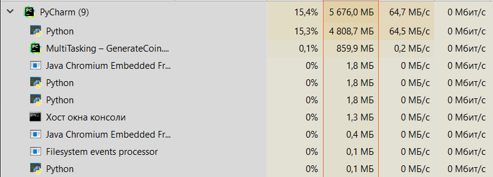

# IO-bound. Проверяем ссылки на страницах Википедии

## Синхронная проверка ссылок

## 5 workers

Процент использования процессора почти не увеличивался за время исполнения, использование сети тоже
почти не менялось и не выходило за пределы 1,1 Мбит/с. Изменялась лишь память, её использование
постепенно росло и пошло до более чем 70 МБ.

## 10 workers

Использование ЦП точно так же не росло. Использование сети же вырастало до 2,5 Мбит/c.
Памяти потребовалось примерно столько же.

## 100 workers

Использование ЦП возросло примерно на 1 процент. Использование сети доходило до 30 Мбит/с.
Памяти потребовалось более чем 100 МБ.

---

# CPU-bound. Генерируем монетки

## Генерация на одном ядре

Я сгенерировал 3 монеты и для этого мне понадобилось 176c.

Т.е. примерно 59с на генерацию одной монеты.

## 2 workers

Главный процесс съел несколько ГБ памяти, worker'ы же меньше 2МБ.
Главный процесс требует до 16% загрузки ЦП. Worker'ы требуют 0,1 %.
Ускорение процесса поиска не очень заметно.

## 4 workers

Главный процесс опять потребляет больше всего.
Рабочие требуют до 8МБ памяти и до 0,8 % загрузки процессора.
Ускорение процесса поиска опять не очень заметно.

## 5 workers

Опять же главный процесс съедает несколько ГБ памяти.
Worker'ы теперь требуют чуть меньше 8МБ.
Главный процесс опять потребляет до 16% ЦП.
Worker'ы же до 0,5%
Ускорение процесса поиска опять не очень заметно.

## 10 workers

Потребление ресурсов компьютера имеет такую же картину, как и для 5 worker'ов.
Только теперь их 10.
Ускорение процесса поиска опять не очень заметно.

## 100 workers

100 worker'ов невозможно запустить из-за ограничения на Windows до 61.